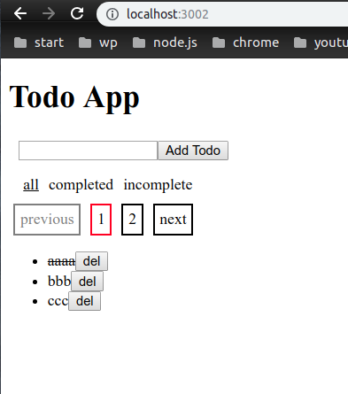

# the todoapp with react ( a client + a server )

To install app go to the /script and execute 

`$ ./install.sh`

and then 

`$ ./start_pm2.sh`

Go to the http://localhost:3002 and you'll see the screen as below

